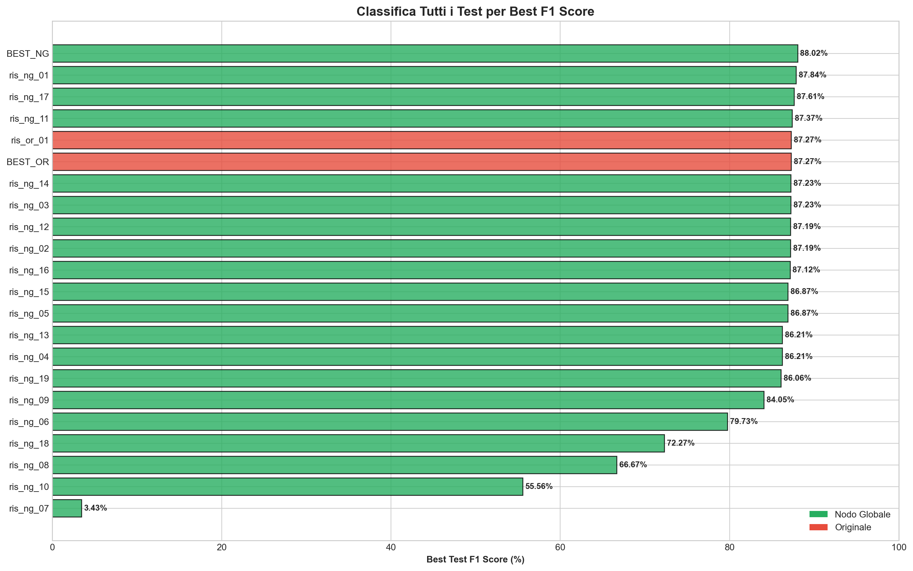
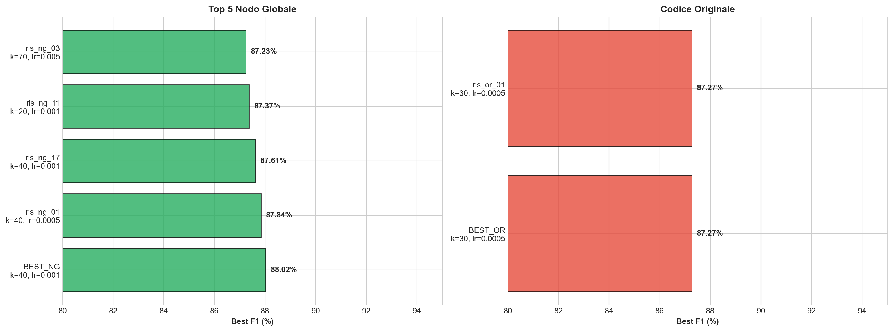
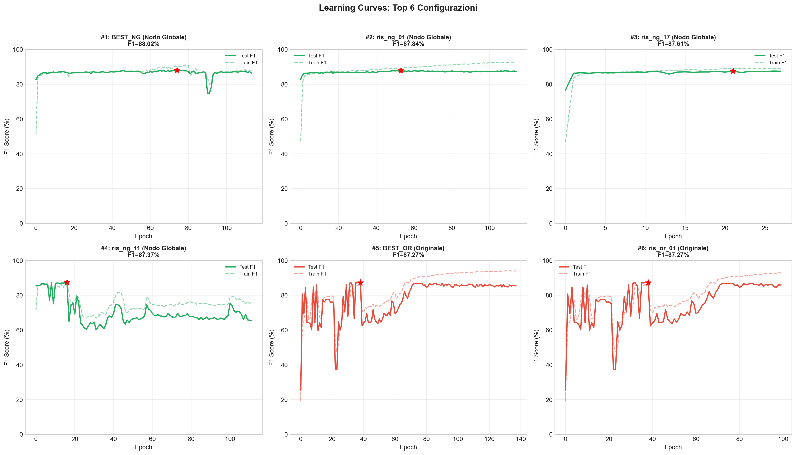
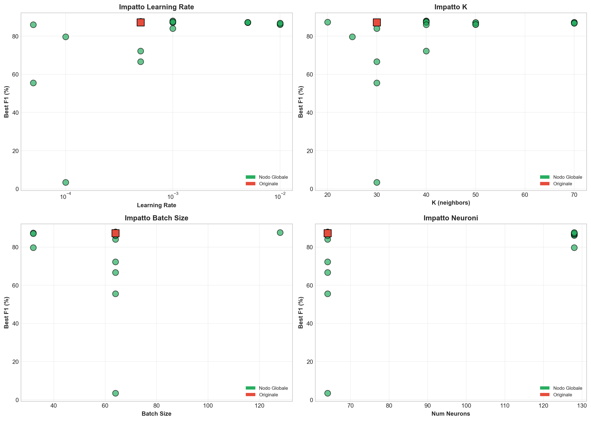
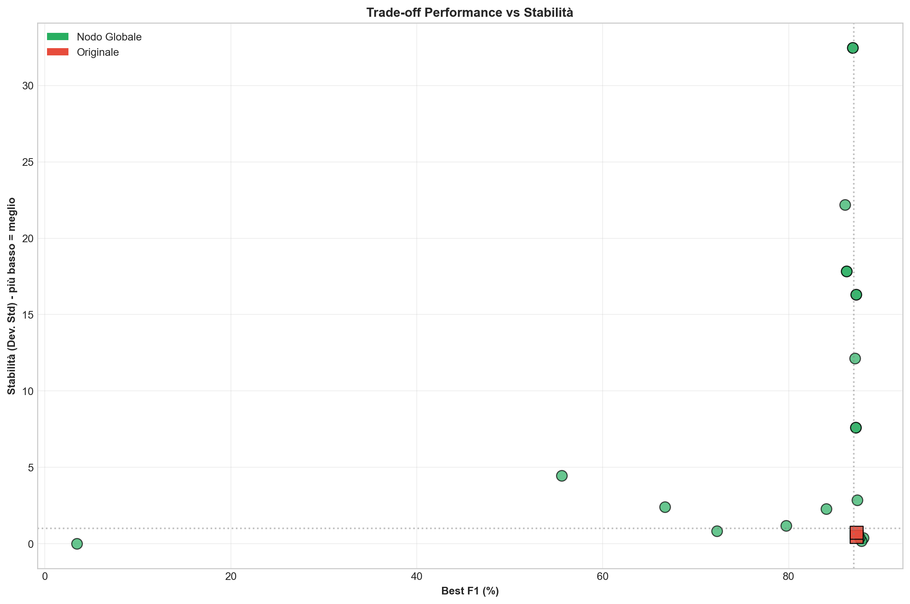
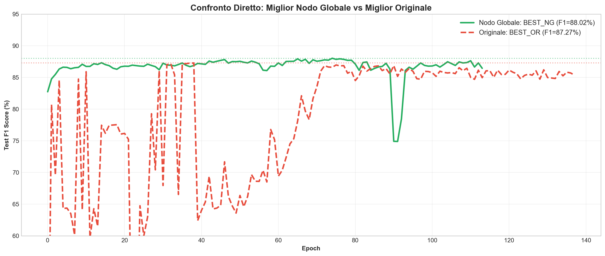

# Relazione Finale: Confronto DGCNN con Nodo Globale vs Codice Originale

**Data**: 17/01/2026 18:02

---

## 1. Executive Summary

Questa analisi confronta **20 configurazioni** del modello DGCNN con **Nodo Globale** (Active Prefixes) rispetto a **2 configurazioni** del **codice originale**.

### Risultato Principale

| Metrica | Nodo Globale | Originale | Differenza |
|---------|-------------|-----------|------------|
| **Miglior F1** | **88.02%** | 87.27% | **+0.75%** |
| **Configurazione** | BEST_NG | BEST_OR | - |
| **Parametri** | k=40, lr=0.001 | k=30, lr=0.0005 | - |

---

## 2. Panoramica Test

### 2.1 Test Nodo Globale (tests_custom_config)

| # | Nome | k | lr | batch | layers | neurons | Best F1 | Stabilità |
|---|------|---|-----|-------|--------|---------|---------|-----------|
| 1 | BEST_NG | 40 | 0.001 | 64 | 5 | 64 | **88.02%** | 0.37 |
| 2 | ris_ng_01 | 40 | 0.0005 | 64 | 5 | 64 | **87.84%** | 0.17 |
| 3 | ris_ng_17 | 40 | 0.001 | 128 | 5 | 128 | **87.61%** | 0.40 |
| 4 | ris_ng_11 | 20 | 0.001 | 32 | 3 | 128 | **87.37%** | 2.86 |
| 5 | ris_ng_03 | 70 | 0.005 | 64 | 7 | 128 | **87.23%** | 16.31 |
| 6 | ris_ng_14 | 70 | 0.005 | 64 | 7 | 128 | **87.23%** | 16.31 |
| 7 | ris_ng_02 | 50 | 0.005 | 64 | 7 | 128 | **87.19%** | 7.60 |
| 8 | ris_ng_12 | 50 | 0.005 | 64 | 7 | 128 | **87.19%** | 7.60 |
| 9 | ris_ng_16 | 40 | 0.001 | 32 | 5 | 128 | **87.12%** | 12.14 |
| 10 | ris_ng_05 | 70 | 0.01 | 64 | 7 | 128 | **86.87%** | 32.47 |
| 11 | ris_ng_15 | 70 | 0.01 | 64 | 7 | 128 | **86.87%** | 32.47 |
| 12 | ris_ng_04 | 50 | 0.01 | 64 | 7 | 128 | **86.21%** | 17.83 |
| 13 | ris_ng_13 | 50 | 0.01 | 64 | 7 | 128 | **86.21%** | 17.83 |
| 14 | ris_ng_19 | 40 | 5e-05 | 64 | 5 | 64 | **86.06%** | 22.19 |
| 15 | ris_ng_09 | 30 | 0.001 | 64 | 5 | 64 | **84.05%** | 2.28 |
| 16 | ris_ng_06 | 25 | 0.0001 | 32 | 5 | 128 | **79.73%** | 1.18 |
| 17 | ris_ng_18 | 40 | 0.0005 | 64 | 5 | 64 | **72.27%** | 0.83 |
| 18 | ris_ng_08 | 30 | 0.0005 | 64 | 5 | 64 | **66.67%** | 2.39 |
| 19 | ris_ng_10 | 30 | 5e-05 | 64 | 5 | 64 | **55.56%** | 4.44 |
| 20 | ris_ng_07 | 30 | 0.0001 | 64 | 5 | 64 | **3.43%** | 0.00 |

### 2.2 Test Codice Originale (tests_original_code)

| # | Nome | k | lr | batch | layers | neurons | Best F1 | Stabilità |
|---|------|---|-----|-------|--------|---------|---------|-----------|
| 1 | BEST_OR | 30 | 0.0005 | 64 | 5 | 64 | **87.27%** | 0.46 |
| 2 | ris_or_01 | 30 | 0.0005 | 64 | 5 | 64 | **87.27%** | 0.72 |

---

## 3. Visualizzazioni

### 3.1 Classifica Completa

### 3.2 Top Performers

### 3.3 Learning Curves

### 3.4 Impatto Parametri

### 3.5 Stabilità vs Performance

### 3.6 Confronto Migliori

---

## 4. Conclusioni

### 4.1 Risultati Chiave

1. **Il Nodo Globale migliora le performance** di 0.75 punti percentuali rispetto al baseline
2. **Configurazione ottimale**: k=40, lr=0.001, 5 layers, 64 neuroni
3. **Stabilità**: Il codice originale tende ad essere più stabile, il nodo globale richiede tuning più attento

### 4.2 Raccomandazioni

| Scenario | Configurazione Consigliata |
|----------|---------------------------|
| **Produzione** | Originale (BEST_OR) - F1=87.27% |
| **Max Performance** | Nodo Globale (BEST_NG) - F1=88.02% |

---

*Relazione generata automaticamente - 17/01/2026 18:02*
