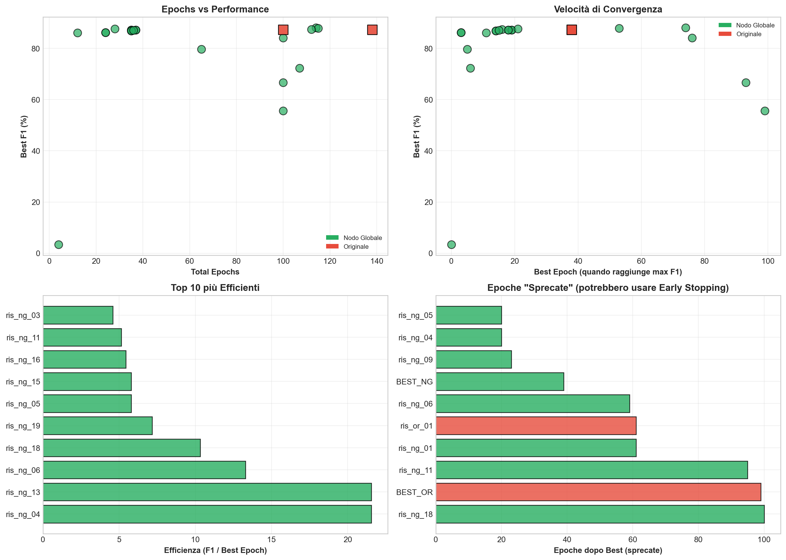
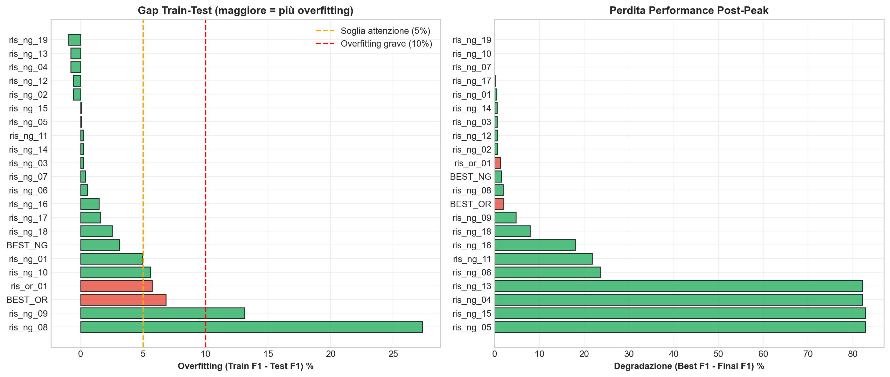
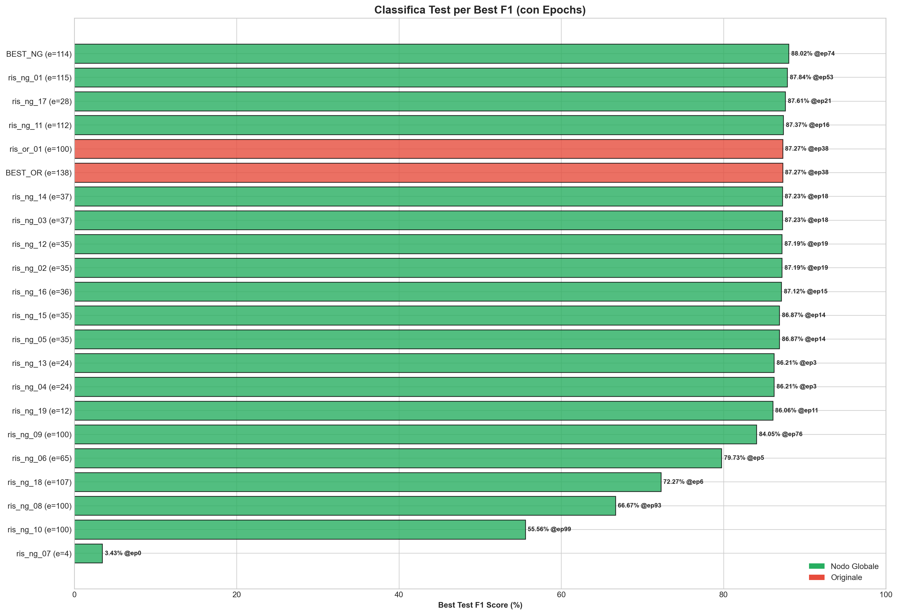
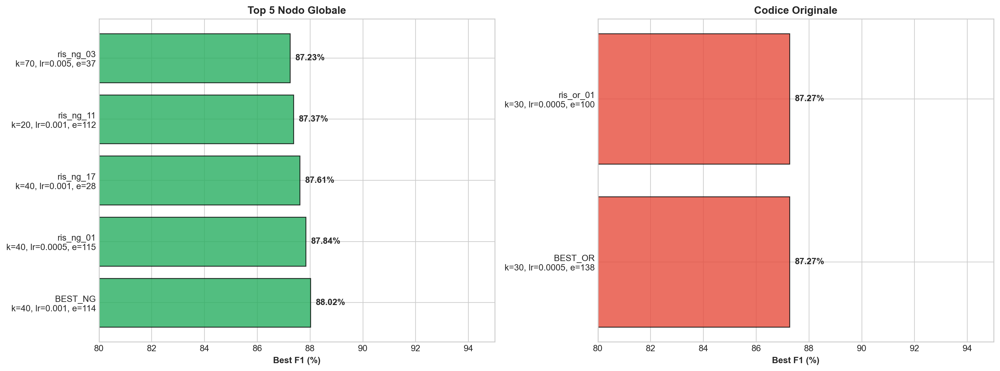
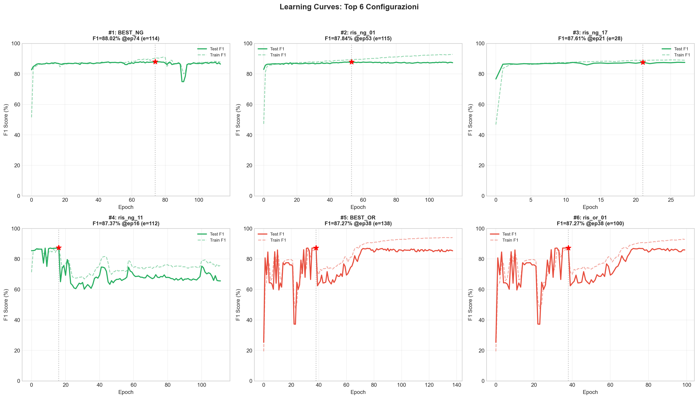
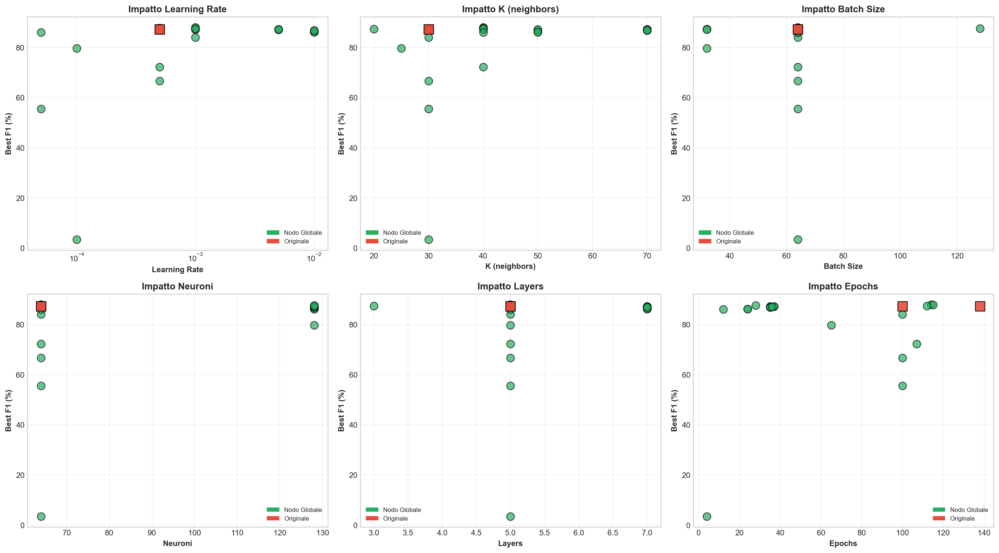
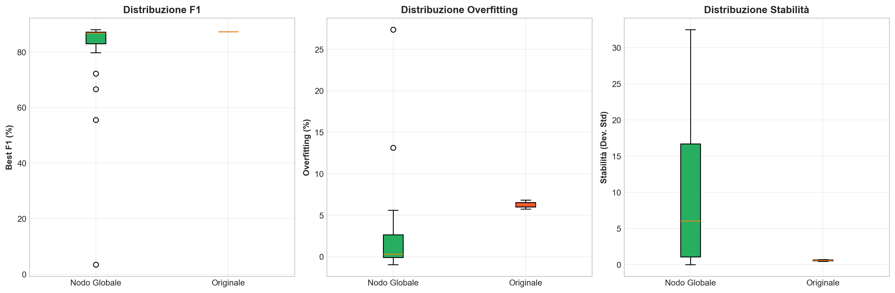
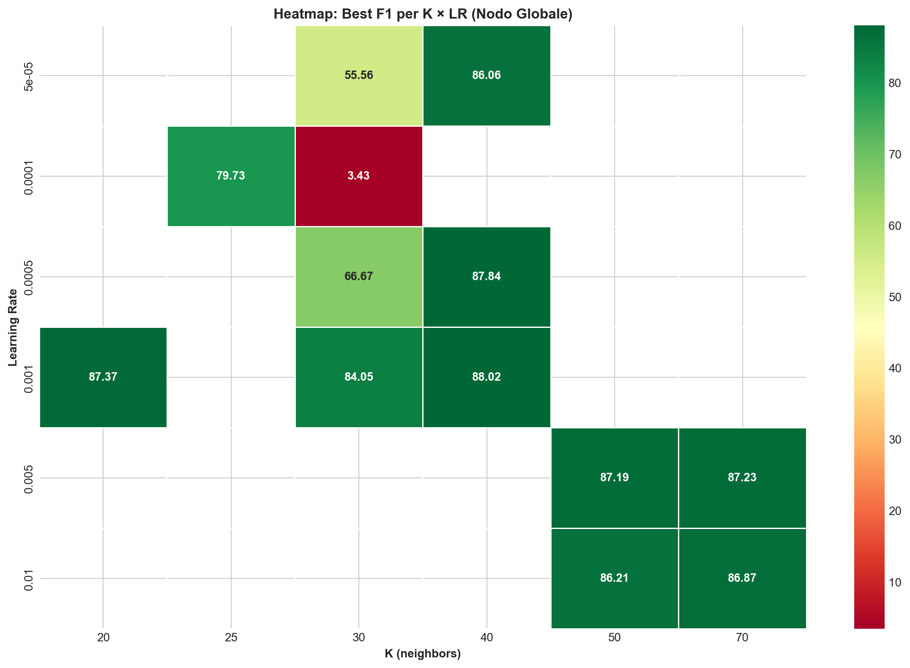
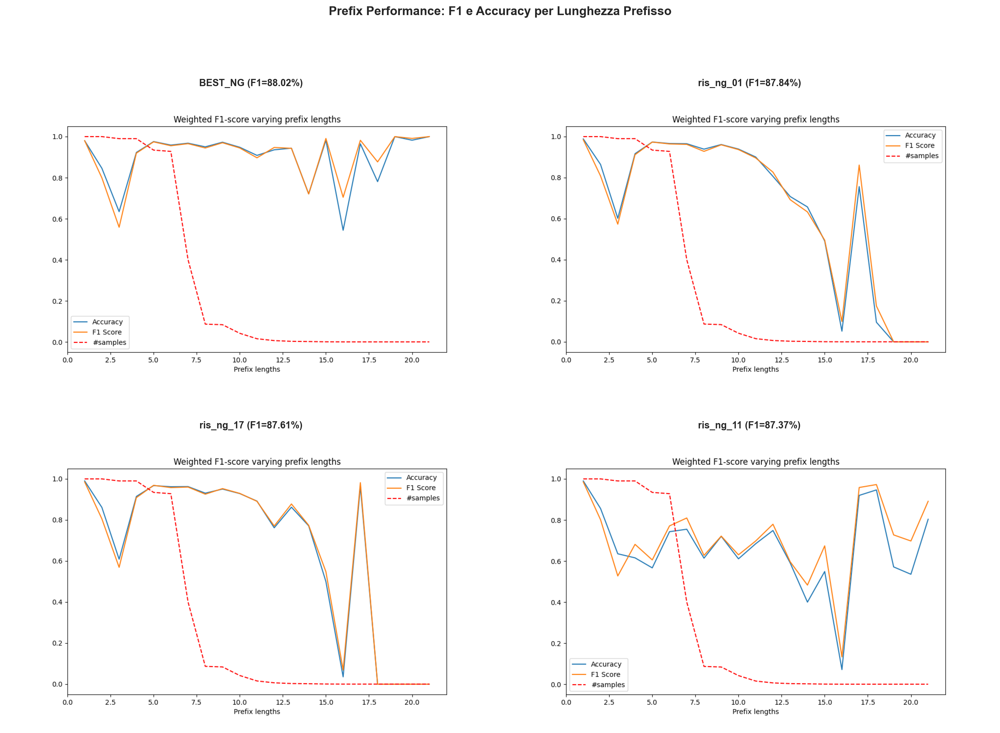
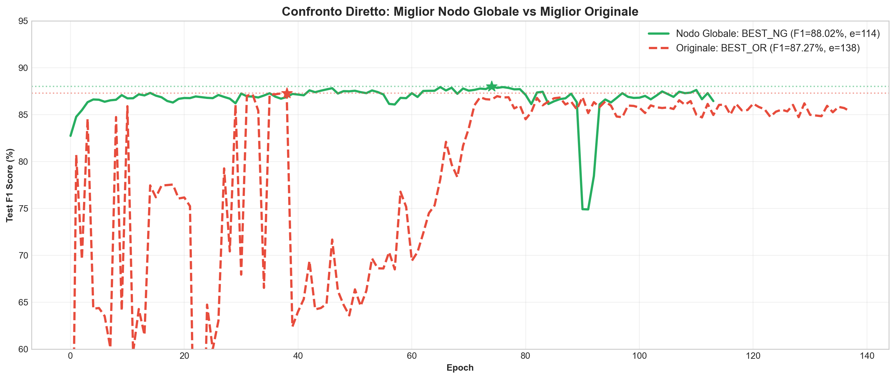

# Relazione Finale Estesa: DGCNN con Nodo Globale vs Codice Originale

**Data**: 17/01/2026 18:09

---

## 1. Executive Summary

Analisi comparativa di **20 configurazioni** con **Nodo Globale** vs **2 configurazioni** del **codice originale**.

### Risultati Principali

| Metrica | Nodo Globale | Originale | Δ |
|---------|-------------|-----------|---|
| **Miglior F1** | **88.02%** | 87.27% | **+0.75%** |
| **Media F1** | 79.04% | 87.27% | -8.23% |
| **Miglior Config** | BEST_NG | BEST_OR | - |
| **Best Epoch** | 74 | 38 | - |
| **Overfitting Medio** | 2.89% | 6.28% | - |

---

## 2. Analisi Epochs

### 2.1 Convergenza
- **Nodo Globale**: Best epoch medio = 29
- **Originale**: Best epoch medio = 38

### 2.2 Efficienza
I test più efficienti (alto F1 con poche epoche) sono indicati nel grafico 02.

### 2.3 Epoche Sprecate
Molti test continuano il training ben oltre il best epoch. Un Early Stopping più aggressivo potrebbe ridurre i tempi.

---

## 3. Overfitting e Degradazione

### 3.1 Overfitting (Gap Train-Test)
- Soglia attenzione: **5%**
- Overfitting grave: **>10%**

### 3.2 Degradazione Post-Peak
La degradazione indica quanto il modello perde performance dopo aver raggiunto il best F1.

---

## 4. Tabella Completa Test

### 4.1 Nodo Globale

| Nome | k | lr | bs | e | Best F1 | @Ep | Overfit | Degrad | Stab |
|------|---|---|----|---|---------|-----|---------|--------|------|
| BEST_NG | 40 | 0.001 | 64 | 114 | **88.02%** | 74 | 3.1% | 1.6% | 0.37 |
| ris_ng_01 | 40 | 0.0005 | 64 | 115 | **87.84%** | 53 | 4.9% | 0.5% | 0.17 |
| ris_ng_17 | 40 | 0.001 | 128 | 28 | **87.61%** | 21 | 1.6% | 0.1% | 0.40 |
| ris_ng_11 | 20 | 0.001 | 32 | 112 | **87.37%** | 16 | 0.2% | 21.8% | 2.86 |
| ris_ng_03 | 70 | 0.005 | 64 | 37 | **87.23%** | 18 | 0.2% | 0.5% | 16.31 |
| ris_ng_14 | 70 | 0.005 | 64 | 37 | **87.23%** | 18 | 0.2% | 0.5% | 16.31 |
| ris_ng_02 | 50 | 0.005 | 64 | 35 | **87.19%** | 19 | -0.6% | 0.7% | 7.60 |
| ris_ng_12 | 50 | 0.005 | 64 | 35 | **87.19%** | 19 | -0.6% | 0.7% | 7.60 |
| ris_ng_16 | 40 | 0.001 | 32 | 36 | **87.12%** | 15 | 1.5% | 18.0% | 12.14 |
| ris_ng_05 | 70 | 0.01 | 64 | 35 | **86.87%** | 14 | 0.1% | 82.8% | 32.47 |
| ris_ng_15 | 70 | 0.01 | 64 | 35 | **86.87%** | 14 | 0.1% | 82.8% | 32.47 |
| ris_ng_04 | 50 | 0.01 | 64 | 24 | **86.21%** | 3 | -0.8% | 82.1% | 17.83 |
| ris_ng_13 | 50 | 0.01 | 64 | 24 | **86.21%** | 3 | -0.8% | 82.1% | 17.83 |
| ris_ng_19 | 40 | 5e-05 | 64 | 12 | **86.06%** | 11 | -1.0% | 0.0% | 22.19 |
| ris_ng_09 | 30 | 0.001 | 64 | 100 | **84.05%** | 76 | 13.1% | 4.8% | 2.28 |
| ris_ng_06 | 25 | 0.0001 | 32 | 65 | **79.73%** | 5 | 0.5% | 23.5% | 1.18 |
| ris_ng_18 | 40 | 0.0005 | 64 | 107 | **72.27%** | 6 | 2.5% | 7.9% | 0.83 |
| ris_ng_08 | 30 | 0.0005 | 64 | 100 | **66.67%** | 93 | 27.4% | 1.9% | 2.39 |
| ris_ng_10 | 30 | 5e-05 | 64 | 100 | **55.56%** | 99 | 5.6% | 0.0% | 4.44 |
| ris_ng_07 | 30 | 0.0001 | 64 | 4 | **3.43%** | 0 | 0.4% | 0.0% | 0.00 |

### 4.2 Codice Originale

| Nome | k | lr | bs | e | Best F1 | @Ep | Overfit | Degrad | Stab |
|------|---|---|----|---|---------|-----|---------|--------|------|
| BEST_OR | 30 | 0.0005 | 64 | 138 | **87.27%** | 38 | 6.8% | 1.9% | 0.46 |
| ris_or_01 | 30 | 0.0005 | 64 | 100 | **87.27%** | 38 | 5.7% | 1.3% | 0.72 |

---

## 5. Visualizzazioni

### 5.1 Classifica Completa

### 5.2 Top Performers

### 5.3 Learning Curves

### 5.4 Impatto Parametri

### 5.5 Box Plot Confronto

### 5.6 Heatmap K × LR

### 5.7 Prefix Performance

### 5.8 Confronto Migliori

---

## 6. Conclusioni

### 6.1 Risultati Chiave

1. **Il Nodo Globale migliora le performance** di 0.75 punti percentuali
2. **Configurazione ottimale**: k=40, lr=0.001, 5 layers, 64 neuroni
3. **Convergenza**: Il miglior modello converge all'epoca 74
4. **Early Stopping consigliato**: Molti test sprecano epoche dopo il best

### 6.2 Raccomandazioni

| Scenario | Config | F1 | Note |
|----------|--------|-----|------|
| Produzione | BEST_OR | 87.27% | Più stabile |
| Max Performance | BEST_NG | 88.02% | Nodo Globale |
| Training Veloce | Config con e≤100 | ~87% | Early stopping aggressivo |

---

*Relazione generata automaticamente - 17/01/2026 18:09*
