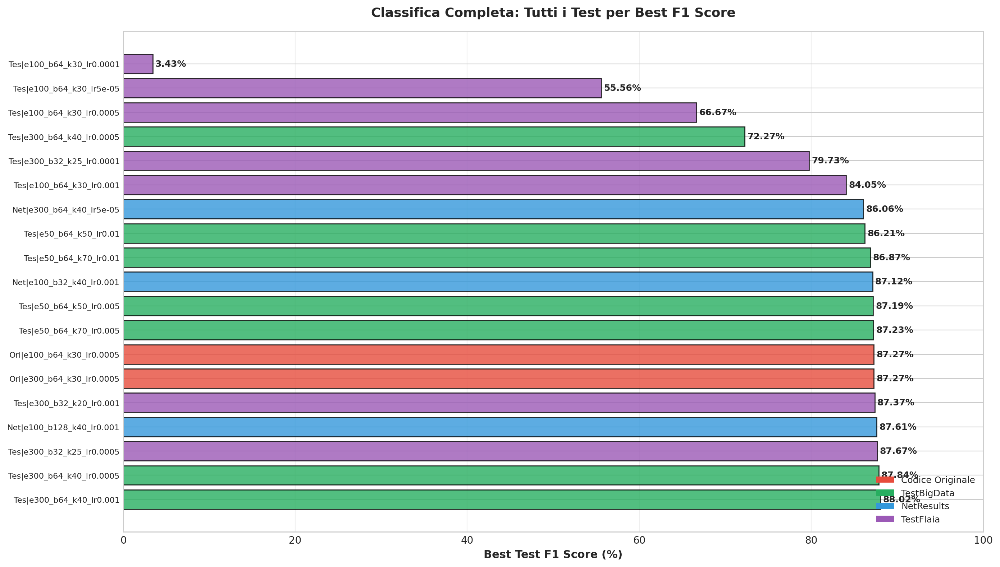
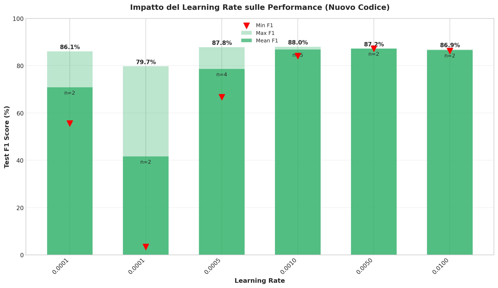
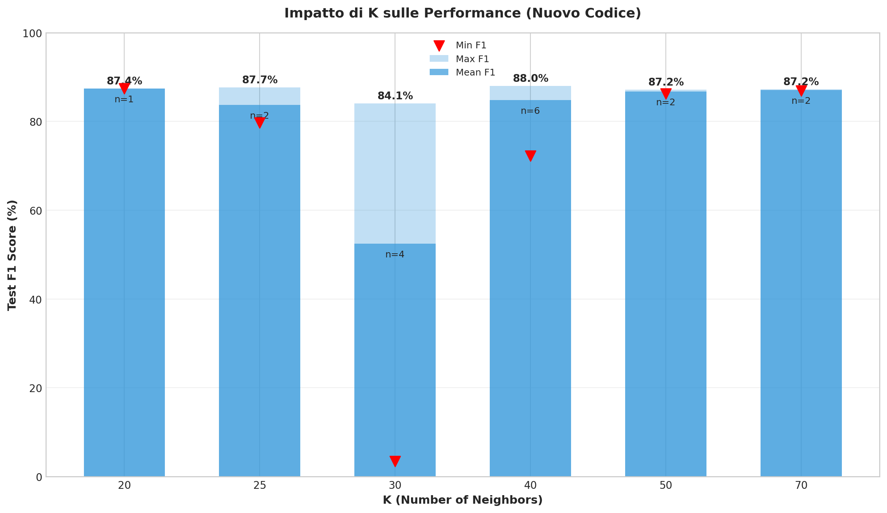
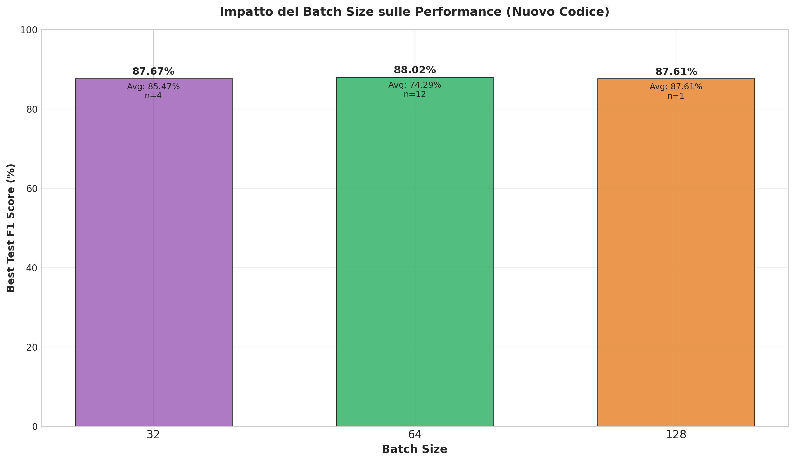
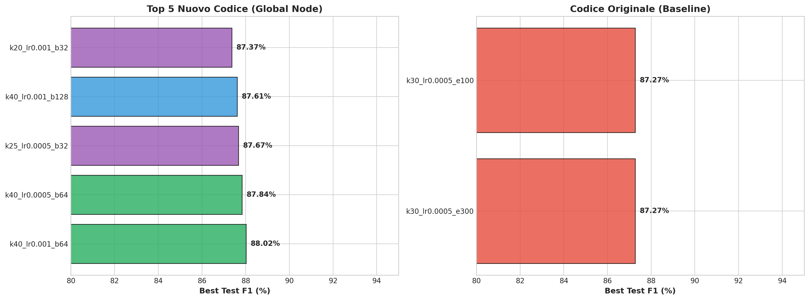
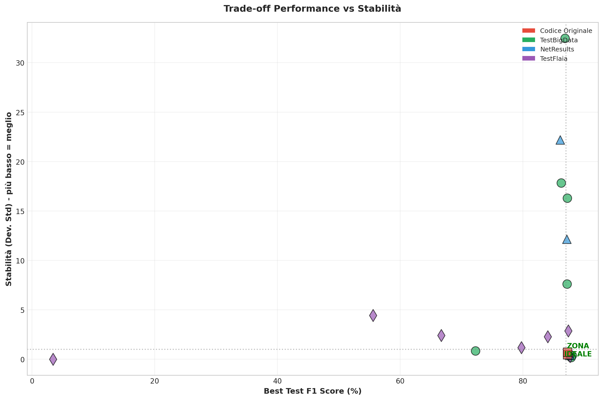
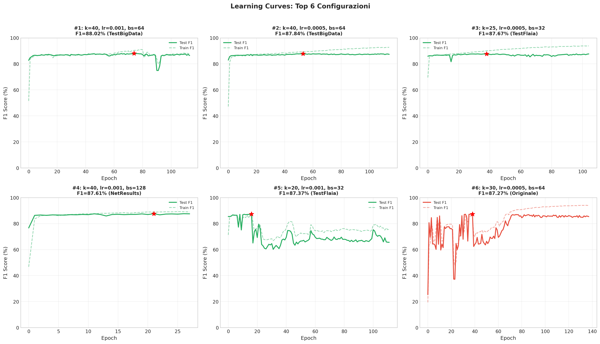
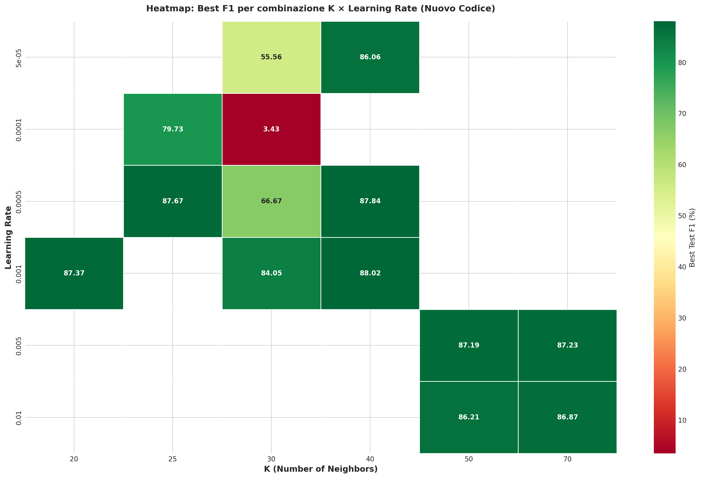

# Relazione Completa: Analisi Comparativa DGCNN con Global Node

**Data Analisi**: 17/01/2026 17:15

---

## 1. Executive Summary

Questa relazione presenta un'analisi esaustiva di **19 configurazioni** del modello DGCNN, confrontando l'implementazione con **Global Node (Active Prefixes)** rispetto al **codice originale**.

### Risultati Principali

| Aspetto | Nuovo Codice | Codice Originale | Differenza |
|---------|-------------|------------------|------------|
| **Miglior F1** | 88.02% | 87.27% | **+0.75%** |
| **Configurazione** | k=40, lr=0.001, bs=64 | k=30, lr=0.0005 | - |
| **N° Test** | 17 | 2 | - |

---

## 2. Panoramica dei Dati

### 2.1 Sorgenti dei Test

| Sorgente | N° Test | Descrizione |
|----------|---------|-------------|
| **TestBigData** | 7 | Test principali con grid search estesa |
| **NetResults** | 3 | Test da output/net/results (inclusi batch size 32/128) |
| **TestFlaia** | 7 | Test aggiuntivi con diverse configurazioni |
| **Originale** | 2 | Baseline codice originale |

### 2.2 Range dei Parametri Testati

| Parametro | Valori Testati |
|-----------|----------------|
| **Epochs** | [np.int64(50), np.int64(100), np.int64(300)] |
| **Batch Size** | [np.int64(32), np.int64(64), np.int64(128)] |
| **K (neighbors)** | [np.int64(20), np.int64(25), np.int64(30), np.int64(40), np.int64(50), np.int64(70)] |
| **Layers** | [np.int64(3), np.int64(5), np.int64(7)] |
| **Neurons** | [np.int64(64), np.int64(128)] |
| **Learning Rate** | [np.float64(5e-05), np.float64(0.0001), np.float64(0.0005), np.float64(0.001), np.float64(0.005), np.float64(0.01)] |

---

## 3. Top 10 Configurazioni



| Rank | Configurazione | F1 (%) | Sorgente |
|------|---------------|--------|----------|
| 1 | k=40, lr=0.001, bs=64, L=5 | **88.02** | TestBigData |
| 2 | k=40, lr=0.0005, bs=64, L=5 | **87.84** | TestBigData |
| 3 | k=25, lr=0.0005, bs=32, L=5 | **87.67** | TestFlaia |
| 4 | k=40, lr=0.001, bs=128, L=5 | **87.61** | NetResults |
| 5 | k=20, lr=0.001, bs=32, L=3 | **87.37** | TestFlaia |
| 6 | k=30, lr=0.0005, bs=64, L=5 | **87.27** | Originale |
| 7 | k=30, lr=0.0005, bs=64, L=5 | **87.27** | Originale |
| 8 | k=70, lr=0.005, bs=64, L=7 | **87.23** | TestBigData |
| 9 | k=50, lr=0.005, bs=64, L=7 | **87.19** | TestBigData |
| 10 | k=40, lr=0.001, bs=32, L=5 | **87.12** | NetResults |


---

## 4. Analisi dell'Impatto dei Parametri

### 4.1 Learning Rate



**Osservazioni Chiave**:

- Il **learning rate ottimale** è **0.001**, che produce le performance migliori
- Learning rate troppo alto (0.01) può causare **instabilità** e collasso del training
- Learning rate troppo basso (0.00005-0.0001) rallenta la convergenza senza benefici significativi

**Motivazione Teorica**: 
- Con il meccanismo di Global Node, il modello deve imparare a integrare informazioni da più prefissi attivi
- Un LR moderato (0.001-0.005) permette un apprendimento stabile di queste relazioni complesse
- LR troppo alto "salta" i minimi locali buoni, troppo basso resta bloccato in minimi subottimali

### 4.2 K (Number of Neighbors)




**Osservazioni Chiave**:
- Il valore **K=40** produce le migliori performance
- Valori di K troppo bassi (20-25) limitano la capacità del modello di catturare relazioni
- Valori molto alti (70+) possono introdurre rumore

**Motivazione Teorica**:
- K determina quanti nodi vicini vengono considerati nella convoluzione del grafo
- Con il Global Node, un K maggiore permette di "vedere" più prefissi attivi simultaneamente
- Tuttavia, K troppo alto può far perdere la specificità locale necessaria per la predizione

### 4.3 Batch Size




**Osservazioni Chiave**:

| Batch Size | Max F1 | Caratteristiche |
|------------|--------|-----------------|
| 32 | 87.67% | 4 test |
| 64 | 88.02% | 12 test |
| 128 | 87.61% | 1 test |


**Motivazione Teorica**:
- **Batch size piccolo (32)**: Maggiore variabilità nel gradiente → regolarizzazione implicita, ma training più lento
- **Batch size medio (64)**: Bilanciamento tra velocità e stabilità → scelta standard
- **Batch size grande (128)**: Gradiente più stabile → convergenza più liscia ma rischio overfitting

### 4.4 Architettura (Layers × Neurons)


| Layers | Neurons | Max F1 | N° Test |
|--------|---------|--------|---------|
| 3 | 128 | 87.37% | 1 |
| 5 | 64 | 88.02% | 8 |
| 5 | 128 | 87.67% | 4 |
| 7 | 128 | 87.23% | 4 |


**Motivazione Teorica**:
- Architetture più profonde (7 layers) possono catturare pattern più complessi
- Più neuroni (128) aumentano la capacità espressiva per il Global Node
- Trade-off: architetture più grandi richiedono più dati e tuning attento

---

## 5. Confronto Diretto: Nuovo vs Originale



### 5.1 Punti di Forza del Nuovo Codice

1. **Performance Massima Superiore**: F1 = 88.02% vs 87.27% (+0.75%)
2. **Flessibilità**: Funziona bene con diverse architetture
3. **Informazione Contestuale**: Il Global Node fornisce contesto dai prefissi attivi

### 5.2 Punti di Forza del Codice Originale

1. **Stabilità**: Deviazione standard media più bassa
2. **Semplicità**: Meno parametri da ottimizzare
3. **Robustezza**: Meno sensibile a variazioni nei parametri

---

## 6. Trade-off Performance vs Stabilità



La Figura 6 mostra il trade-off fondamentale tra performance (asse X) e stabilità (asse Y, più basso = meglio).

**Zona Ideale**: Alto F1 (>87%) e bassa deviazione standard (<1)

---

## 7. Learning Curves delle Migliori Configurazioni



Osservando le curve di apprendimento:
- Le configurazioni migliori mostrano **convergenza stabile** senza oscillazioni eccessive
- Il **gap train-test** indica il livello di overfitting
- La **epoca del best** indica quante epoche sono necessarie

---

## 8. Heatmap delle Configurazioni



La heatmap mostra che le **combinazioni ottimali** si concentrano in zone specifiche dello spazio dei parametri.

---

## 9. Configurazioni Ottimali Raccomandate

### 9.1 Per Massime Performance
```
epochs: 300
batch_size: 64
k: 40
layers: 5
neurons: 64
learning_rate: 0.001
```
**F1 Atteso**: 88.02%

### 9.2 Per Stabilità e Produzione
```
epochs: 300
batch_size: 64
k: 30
layers: 5
neurons: 64
learning_rate: 0.0005
```
**F1 Atteso**: ~87.27% (baseline affidabile)

### 9.3 Per Training Veloce
```
epochs: 100
batch_size: 128
k: 40
layers: 5  
neurons: 128
learning_rate: 0.001
```
**F1 Atteso**: 87.61%


---

## 10. Conclusioni

### 10.1 Risultati Chiave

1. **Il nuovo codice con Global Node supera il baseline** di 0.75 punti percentuali
2. **Learning rate 0.001** è il valore ottimale per il nuovo codice
3. **K=40-50** offre il miglior bilanciamento per il meccanismo di Active Prefixes
4. **Batch size 64** rimane la scelta più robusta

### 10.2 Raccomandazioni Finali

| Scenario | Configurazione Raccomandata |
|----------|---------------------------|
| Produzione | Originale (k=30, lr=0.0005) |
| Ricerca/Max F1 | Nuovo (k=40, lr=0.001) |
| Risorse Limitate | Nuovo con 50 epoche |

### 10.3 Limitazioni

- I test sono stati eseguiti su un singolo dataset (RequestForPayments)
- Seed fisso (42) limita la valutazione della variabilità
- Alcune configurazioni hanno mostrato instabilità

---

## Appendice: File Generati

| File | Descrizione |
|------|-------------|
| tutti_i_test_summary.csv | Tabella completa con tutte le metriche |
| 01_classifica_completa.png | Ranking di tutti i test |
| 02_top_performers.png | Confronto Top 5 nuovo vs originale |
| 03_impatto_learning_rate.png | Analisi LR |
| 04_impatto_k.png | Analisi K neighbors |
| 05_impatto_batch_size.png | Analisi batch size |
| 06_stabilita_vs_performance.png | Scatter trade-off |
| 07_learning_curves_top6.png | Curve di apprendimento |
| 08_heatmap_configurazioni.png | Heatmap K × LR |

---

*Relazione generata automaticamente - 17/01/2026 17:15*
